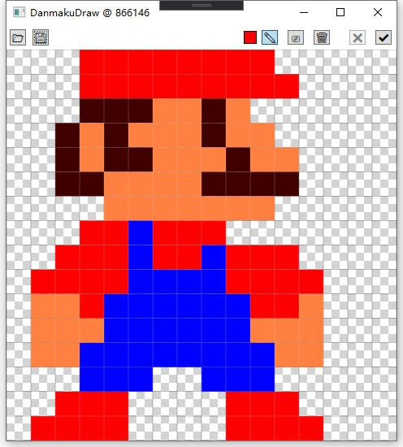

# DanmakuDraw

## Introduction

Used to draw graphics on the "live danmaku interactive drawing board" in the Bilibili live room [866146](https://live.bilibili.com/866146)

用于在Bilibili直播间[866146](https://live.bilibili.com/866146)的"直播弹幕交互画板"上绘制图形

## Preview

## Remark

You need to scan the QR code to login when the first time you use it in order to send danmaku commands. After logging in, the software will create a cookies.dat file to store the login information. If you need to logout, just delete cookies.dat and restart the software.

首次使用时，您需要扫描QR码以登录，以便发送danmaku命令。 登录后，软件将创建一个cookies.dat文件来存储登录信息。 如果您需要注销，只需删除cookies.dat并重新启动软件即可。

## Reference

Live room project link: [https://github.com/Nigh/BiliLiveDanmuUI_Hardware](https://github.com/Nigh/BiliLiveDanmuUI_Hardware)

直播间项目链接: [https://github.com/Nigh/BiliLiveDanmuUI_Hardware](https://github.com/Nigh/BiliLiveDanmuUI_Hardware)
